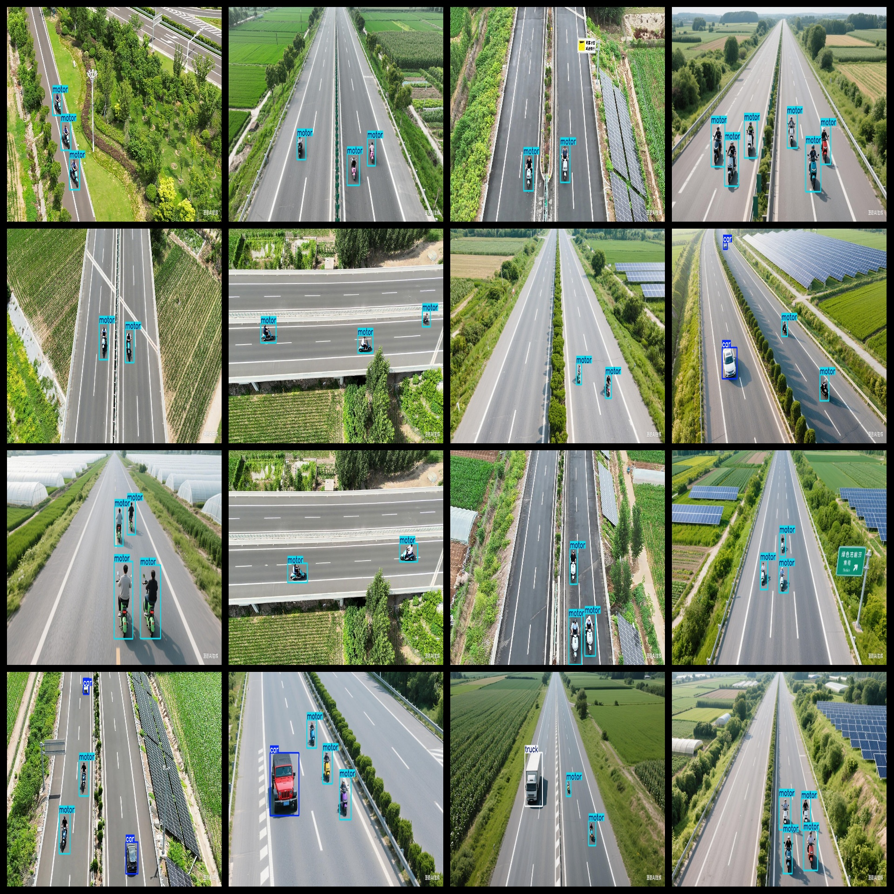

# Airway Highway Car Motorcycle Truck Dataset: 886 images, VOC+YOLO

Dataset format: Pascal VOC format + YOLO format (txt file without segmentation path, only includes jpg images and corresponding VOC format xml files and yolo format txt files)

Number of images (jpg files): 886

Number of annotations (xml files): 886

Number of annotations (txt files): 886

Number of annotation categories: 3

Repository: datasets_sl

Annotation category names (notice that the order of categories in the yolo format does not correspond to this, but is based on the "labels" folder's "classes.txt"): ["car", "motor", "truck"]

Number of boxes for each category:

car boxes = 324

motor boxes = 2895

truck boxes = 47

Total boxes = 3266

Number of pictures per category:

car pictures = 253

motor pictures = 886

truck pictures = 47

Image resolution: 1312x736

Annotation tool used: labelImg

Dataset enhancement status: No

Annotation rules: Draw bounding boxes for each category

Important note: The dataset does not have a split into training, validation, or test sets; you need to partition it yourself.

Special declaration: This dataset does not guarantee any accuracy for models trained or weight files.

Annotation and image details are as follows:

## Images

---

Here is a pay link on Stripe (https://buy.stripe.com/3cs8yP7sY87d0vu9AB). Please contact me lonlonago@foxmail.com after funding $89, and I will send you a complete data files, thank you!

